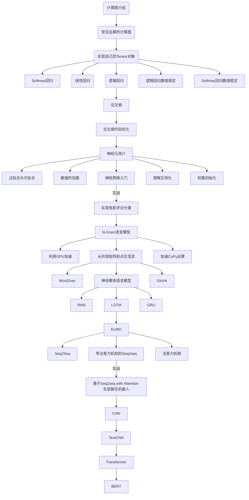

# metagrad

* 一个用于学习的仿PyTorch纯Python实现的自动求导工具，参考了PyTorch和tinygrad等优秀开源工具。
* 本着“凡我不能创造的，我就不能理解”的思想，基于纯Python以及NumPy从零创建自己的深度学习框架，该框架类似PyTorch能实现自动求导。
* 从自己可以理解的角度出发，创建一个自己的深度学习框架，让大家切实掌握深度学习底层实现，而不是仅做一个调包侠。
* 核心代码少，适用于教学。

# 实现教程
一步一步实现教程： [从零实现深度学习框架](https://helloai.blog.csdn.net/article/details/122024643)

# 线路图

